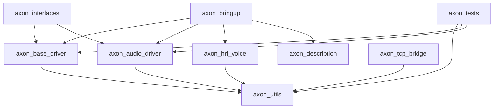
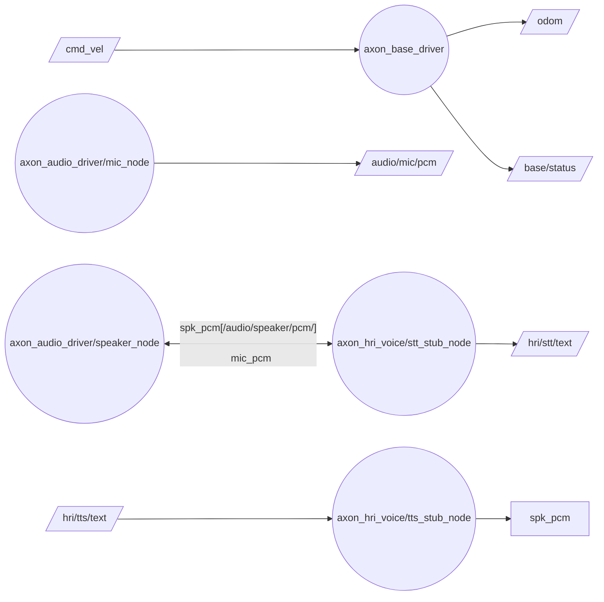
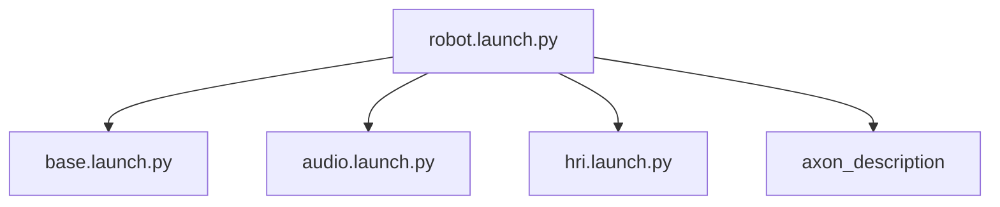

# Axon ROS 2 Architecture

This document describes the package layout and runtime composition for the Axon robot workspace.

## Package Dependency Graph

## Runtime Node Graph (Topics)

## Launch Composition Graph

